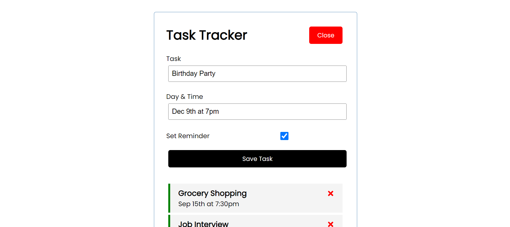

# Project Demo

https://react-task-tracker-hosting-production.up.railway.app/

## Add tasks

Click the add button and type in your task and save

## Update tasks

Double click the task to change the reminder state

## Delete tasks

Click the delete icon

